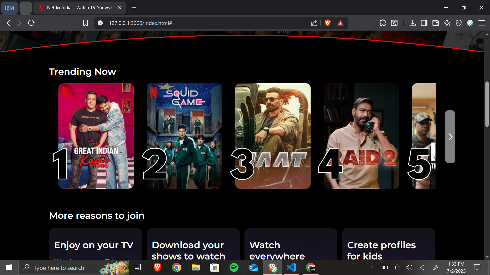
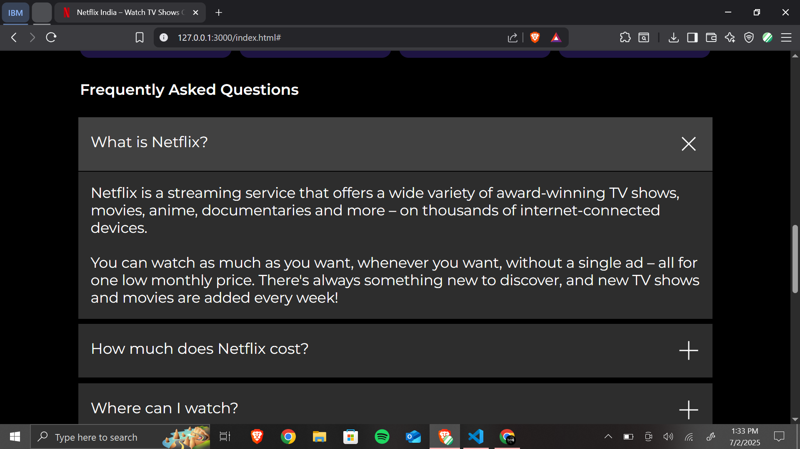
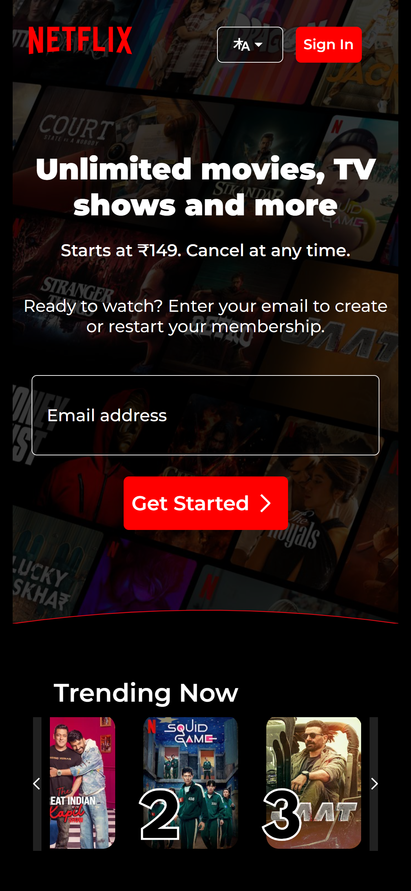
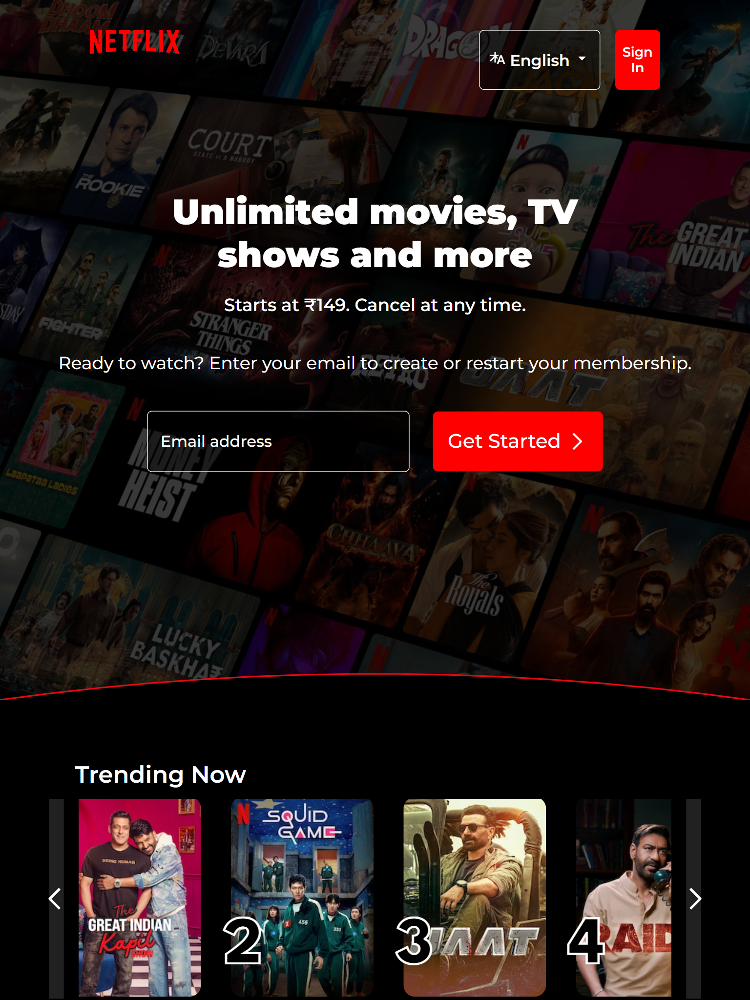

# 🎬 Netflix Layout – Responsive UI Clone

Welcome to **Netflix Layout**, a pixel-perfect clone of the Netflix India landing page built using **HTML, CSS, and JavaScript**. This project recreates the responsive layout, stylish visuals, and interactivity found on the real Netflix homepage.

---

## 🔗 Live Demo

🚀 **Explore it live here** → [Netflix Layout on GitHub Pages](https://sarthak536.github.io/Netflix-Layout/)

---

## 📂 Project Structure

```plaintext
📁 Netflix-Layout/
├── index.html       # Main HTML layout
├── style.css        # Styling including responsive design
├── script.js        # All JavaScript interactivity
└── assets/          # Contains images, SVGs, and screenshots
```

---

## ✨ Key Features

- 🎥 **Hero Section** with layered background and email input
- 🌐 **Language Dropdown** with hover highlighting
- 🔥 **Trending Carousel** with animated scroll and arrows
- 📱 **Fully Responsive** across mobile, tablet, and desktop
- ❓ **FAQ Section** with interactive accordion behavior
- 💡 **Smooth Transitions** and hover animations for engaging UI

---

## 📸 Screenshots

### 💻 Desktop View

<br><br>
<br><br>
<br><br>

---

### 📱 Mobile View

<br><br>

---

### 📟 Tablet View



---

## 🛠️ Tech Stack Used

- **HTML5** – Semantic structure and markup
- **CSS3** – Flexbox, Grid, Media Queries, Transitions
- **JavaScript** – DOM manipulation and interactive UI
- **Google Fonts** – `Montserrat`, `League Spartan`

---

## 🧪 Run This Project Locally

```bash
# Clone the repo
git clone https://github.com/sarthak536/Netflix-Layout.git

# Navigate into the folder
cd Netflix-Layout

# Open in browser (or just double-click index.html)
open index.html
```

---

## 🚀 Deployment Options

This project is deployed on **GitHub Pages**  
You can also deploy it using:

- [Vercel](https://vercel.com) – One-click deploy & custom domains
- [Netlify](https://netlify.com) – Great for frontend static hosting

---

## 💬 Feedback & Contributions

If you have suggestions, ideas, or want to improve the design/functionality, feel free to:

- ✨ Open an issue
- 📥 Submit a pull request
- ⭐ Star this repo if you found it helpful!

---

## 📝 License & Disclaimer

This project is for **educational/demo purposes only**.  
All images, brand names, and assets belong to [Netflix](https://netflix.com).

---
